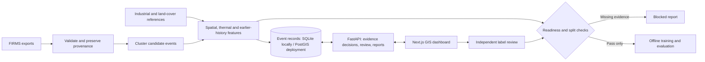
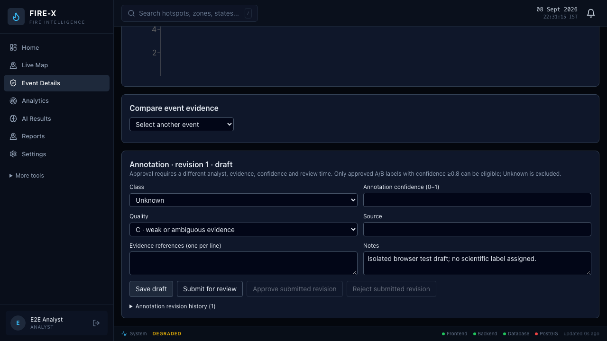

# FIRE-X

**AI-Based Detection and Classification of Industrial Fires and Persistent Thermal Sources Using NASA FIRMS, OSM & Satellite Data**

SIH 2026 project brief: PS **26162**, NTRO · Software · Disaster Management.

**Current status: DATA BLOCKED — `training_ready=false`.** The software can prepare and review observations. Representative India data, industrial and land-cover references, and independently reviewed labels are still missing. There is no validated India classifier or measured project-model performance. 

## Problem and proposed solution

A NASA FIRMS thermal detection gives a location and measurements, not a confirmed cause. It could reflect a fire, agricultural burning, a furnace or a flare. FIRE-X brings the observation, nearby infrastructure and earlier activity together so a reviewer can assess the likely source and supporting evidence.

The prototype supports evidence review and dataset preparation. It is not a certified emergency-response system. “36-hour hackathon MVP architecture” describes the submission scope, not the age or authorship of the code.

## How it works



Individual detections are grouped using spatial **and** temporal proximity. Connected observations may form long chains, so clusters remain candidate events. Historical features use observations strictly before event start. Missing reference coverage stays unknown.

## Source architecture in two minutes

| Responsibility | Open this file first |
|---|---|
| Load, normalize, validate and archive FIRMS | [preprocessing.py](backend/app/ml/data/preprocessing.py) |
| Distances, CRS and geometry context | [engine.py](backend/app/gis/engine.py); [spatial_features.py](backend/app/ml/spatial_features.py) adds event features |
| Group detections, enrich events and save artifacts | [build_dataset.py](backend/app/ml/build_dataset.py) |
| Decide, explain and load only approved event models | [event_intelligence.py](backend/app/services/event_intelligence.py) |
| Database sessions and table initialization | [database.py](backend/app/database.py); ORM tables remain in `models.py` and `event_models.py` |
| HTTP registration and event review | [main.py](backend/app/main.py); [thermal_events.py](backend/app/routers/thermal_events.py) |
| Map, filters, evidence and annotation form | [event workspace](frontend/app/(app)/event-workspace/page.tsx) |

The existing filenames preserve useful CLI contracts. One giant `routes.py` or `classifier.py` would mix authentication, demo behavior and scientific review. [Architecture](docs/ARCHITECTURE.md) explains the retained boundaries.

## AI / classification logic

The reviewed-event path uses **evidence rules** until an operator approves a model against the existing real-data gate. Without sufficient evidence it returns `Unknown`, unavailable confidence and an explanation. Persistence and FRP anomaly indicators are descriptive heuristics, not calibrated probabilities. The separate legacy hotspot dashboard uses heuristic classifications and risk scores.

Offline training uses **scikit-learn's HistGradientBoostingClassifier** — a histogram-based gradient boosting architecture optimized for speed and memory efficiency over traditional Random Forest (which runs heavy iterative tree loops). Optional XGBoost/LightGBM/CatBoost boosters are evaluated when installed. Evaluation and optional SHAP/anomaly tooling exist, but have no representative project evaluation. No model was trained during this refactor. Legacy demo artifacts cannot replace reviewed event models.

## Data sources and separation

- **NASA FIRMS:** original CSV/Parquet, WGS84 coordinates, UTC acquisition times, sensor metadata and native confidence.
- **Industry/land cover:** sourced GeoJSON derivatives, stable identities, documented CRS, validity dates and actual coverage. Raw raster interpretation is not implemented.
- **Labels:** real event IDs, source evidence, reviewer identity and independent approval. Proximity or recurrence alone is not a label.

`data/incoming/` is the documented real-data inbox; `data/input/firms/india/` is also supported through explicit CLI paths. `data/raw/` preserves originals, while `data/processed/` and `data/ml/` hold derived artifacts. `data/samples/` contains the published NASA tutorial excerpt, which is outside India. Synthetic dashboard examples belong to a separate demo database; never reuse that database for real-data work.

See [data sources](docs/DATASETS.md) and the [exact input checklist](docs/REAL_DATA_INPUT_CHECKLIST.md). No input folders or existing artifacts were moved in this refactor.

<a id="repository-structure"></a>

## Tech stack and project structure

Python/FastAPI, Pydantic, SQLAlchemy; pandas/Parquet, Shapely/PyProj, scikit-learn; Next.js/React, TypeScript, Tailwind, MapLibre and Recharts. SQLite supports local development. Docker/PostGIS definitions exist but have not been runtime-verified here.

```text
backend/app/
  main.py, config.py, database.py, models.py, event_models.py
  ml/data/preprocessing.py     FIRMS loading and validation
  ml/build_dataset.py          Clustering and feature assembly
  ml/                         Schemas, reference checks, review gates and offline tools
  gis/engine.py               Spatial calculations
  services/event_intelligence.py  Event inference and explanations
  services/                   Working alerts, reports, history and authentication helpers
  providers/                  Live/file adapters and explicit demo modes
  routers/                    Event review, context, analytics and supporting APIs
backend/tests/                Detailed regression tests
backend/migrations/           Preserved PostGIS migration
frontend/app/                 Pages and layouts
frontend/components/          Maps, evidence panels and shared controls
frontend/lib/                 API client, types and authentication
frontend/tests/e2e/           Browser checks
scripts/                     Saved-evidence reporting helper
data/                        Real-input instructions, templates and separate tutorial sample
docs/                        Architecture, data, demo and developer guides
docs/archive/                Historical engineering reports
```

## API

There are **61 operations in non-demo mode**, plus four explicit demo operations. Main paths include:

| Path | Purpose |
|---|---|
| `GET /api/v1/health` | Basic service check |
| `GET /api/v1/thermal-events` | Filter imported events |
| `GET /api/v1/thermal-events/{event_id}` | Event observations and evidence |
| `POST /api/v1/thermal-events/{event_id}/analyze` | Event decision and explanation |
| `GET /api/v1/infrastructure` | Stored facility context |
| `GET /api/v1/analytics` | Legacy dashboard statistics |

The [complete API reference](docs/API.md) records roles and behavior. Runtime schemas are at `/docs` and `/openapi.json`. No HTTP endpoint trains models.

## Running locally

Use Python 3.12 and Node.js 20. From the repository root:

```sh
python3.12 -m venv .venv
source .venv/bin/activate
pip install -r backend/requirements-dev.txt
cp backend/.env.example backend/.env
cp frontend/.env.local.example frontend/.env.local
cd frontend
npm ci
cd ..
```

Copy environment examples only when those local files do not already exist. Backend configuration comes from `backend/.env` through `app/config.py`; frontend public settings use `frontend/.env.local`.

Backend terminal:

```sh
source .venv/bin/activate
cd backend
uvicorn app.main:app --reload --host 127.0.0.1 --port 8000
```

Frontend terminal:

```sh
cd frontend
npm run dev
```

Open [the dashboard](http://localhost:3000) and [API docs](http://localhost:8000/docs). For a built frontend, use `npm run build` then `npm start`; the start script supports the configured standalone output.

## Demo mode and walkthrough

The local example enables `DEMO_MODE=true` and seeds demonstration records on first startup. Its local-only account is `npgearly@gmail.com` / `admin123`. The explicit seed command resets demo tables; never point it at a database you want to retain.

With `DEMO_MODE=false`, demo routes and controls are unavailable. For real-data work, start with a separate empty database, `ML_MODE=rules` and no `EVENT_MODEL_PATH`; create an account using `python -m app.create_admin`. Restart after changing mode.

The walkthrough is: open the map → inspect source status → filter/select an event → inspect observations, infrastructure, land cover and earlier activity → read the decision/explanation → record an honest review. Missing India observations and reference coverage must remain visible. See [the demo guide](docs/SIH_DEMO_GUIDE.md).



Actual browser-test capture from a disposable tutorial database. The annotation is an `Unknown` draft and external map tiles are disabled. It demonstrates the interface, not India coverage or model accuracy.

## Testing

```sh
# Repository root, with the virtual environment active
python -m pytest backend/tests -q

# Frontend directory
npm run typecheck
npm run build
npx playwright install chromium
npm run test:e2e
```

Tests isolate databases, uploads, model paths and the email outbox. Browser checks use temporary servers on ports 3101 and 8101. Detailed groups and limits are in the [developer guide](docs/DEVELOPER_GUIDE.md). Typechecking/build do not replace security or accessibility review; build linting is currently skipped.

## Current data / training status and limitations

**Models trained for this project: none. Training remains blocked.** India observations, industrial/land-cover reference coverage and reviewed labels are missing. Readiness thresholds and scientific review requirements are unchanged.

Implemented software includes validation, event construction, reference enrichment, independent annotation review and offline readiness checks. Satellite evidence currently supplies catalog metadata; automated pixel confirmation is future work. Optional learned tooling is unvalidated. Some legacy read APIs remain public. Docker/PostGIS, multi-worker operation, load/recovery and public-deployment security need separate verification.

## Future scope and team

Acquire and review real data, then evaluate simple models and their errors. Consider calibration, geographic transfer and imagery evidence only with adequate data. Distributed queues, microservices and multimodal research are not required for the MVP. See the [roadmap](docs/ROADMAP.md).

A verified team roster has not been supplied. Git history records actual contributions; this refactor does not reconstruct a 36-hour development history or assign fictional roles. No project license has been selected; dependencies and datasets retain their respective terms.

[Documentation index](docs/README.md) · [Historical reports](docs/archive/README.md) · [Refactor evidence and merge map](docs/archive/MVP_REFACTOR.md)
