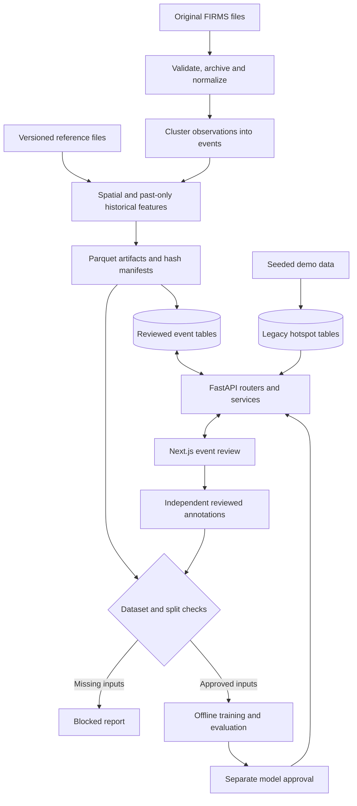

# Architecture

FIRE-X uses a single FastAPI application, a Next.js frontend and one relational database. Python command-line tools prepare datasets and run approved experiments outside HTTP requests. This is small enough for a student team to understand without hiding data-quality checks.

## Read the pipeline in order

1. `ml/data/preprocessing.py`: reading, timestamps, normalization, rejection reasons and immutable-source copies.
2. `gis/engine.py` and `ml/spatial_features.py`: geometry math and event-specific context; `ml/reference_bundle.py` validates sourced layers.
3. `ml/build_dataset.py`: clustering, event statistics, earlier-history features and artifact writing in one place.
4. `services/event_intelligence.py`: evidence rules, explanations and approval-checked model inference. Existing anomaly class import identity is retained for artifact compatibility.
5. `ml/import_events.py`, database models and `routers/thermal_events.py`: stored observations, predictions and independent annotation review.
6. `frontend/app/(app)/event-workspace/page.tsx`: map, filtering, selection, evidence and review.

## Decisions

| Decision | Reason and trade-off |
|---|---|
| Consolidate preparation and event building | Small adjacent implementations now share their existing CLI entry points. Event-column definitions live with the dataset schema to avoid a circular import. |
| Consolidate event inference | Model approval/loading and evidence decisions now share `event_intelligence.py`; gate checks and trusted-file restrictions remain unchanged. |
| Group read-only context and history | `routers/context.py` serves facilities, zones and satellite records; `routers/analytics.py` serves charts and history. URLs, tags and schemas remain unchanged. |
| Preserve configuration, database and frontend paths | They are already coherent. No duplicate root environment files, `src/` migration, database change or extra CLI wrapper is needed. |
| Keep one backend | Routers call domain functions directly; no extra service deployment or repository layer is needed. |
| Register demo routes only in explicit demo mode | Remove four demonstration operations from the real-data API and its schema while preserving the local walkthrough. A request guard also rejects them if demo mode is disabled at runtime. |
| Use direct notification functions | One dispatcher calls database/SSE and email functions; four provider classes added no independent integrations. SMS retains an explicit unavailable response for compatibility. |
| Remove unused storage adapter | No application path called it. Keep local static-file serving; implement S3 only with an actual upload workflow and tests. |
| Reuse the existing refresh handler | The bulk classification endpoint and refresh endpoint perform the same operation. Preserve both URLs with one implementation. |
| Keep routers by feature | Auth, hotspots, alerts and event review have different contracts. Combining all routes would create a harder-to-read file. Activity and SSE now share `routers/events.py`, retaining both URLs. |
| Keep `services`, `providers`, `gis` and `ml` | They separate business behavior, external I/O, spatial math and offline experiments. Provider variants implement real mode differences rather than abstracting a single function. |
| Read FIRMS files inside preprocessing | The former one-function `firms_loader.py` added a navigation step but no independent policy. Normalization remains separately testable. |
| Keep the two data schemas | Legacy seeded hotspots and reviewed event artifacts have different identities/features. Merging them could mix demonstration data into training or break saved model compatibility. |
| Keep separate label and split modules | Independent review, artifact integrity and spatial/temporal leakage checks are necessary scientific controls, even in a small project. |
| Keep experiments offline | HTTP inference never starts training. A valid dataset does not automatically approve a production model. |
| Use SQLite locally | It keeps setup straightforward. PostgreSQL/PostGIS and its explicit migration need separate deployment verification. |
| Use in-process SSE | Sufficient for the current single-worker design. There is no Redis integration; cross-worker fan-out is future work. |
| Keep shared UI components | Maps, tables, status, badges and dialogs are reused. A small route that wraps a working component is not an empty page. |
| Keep seven main navigation entries | Home, Live Map, Event Details, Analytics, AI Results, Reports and Settings form the main path. Existing supporting tools remain under More tools. |
| Remove inactive settings controls | Stored preferences were never read by maps, notifications, theme or risk logic. Settings now links to the working account page and shows refreshable provider status. |
| Preserve CLI/import contracts where useful | The synthetic trainer and optional anomaly command remain available but explicitly outside the required workflow. No training was run in this refactor. |

## Evidence boundaries

An event is a connected cluster of observations, not a confirmed incident. Long spatial or temporal chains need review. Facility proximity is context, not causation. The 90-day history includes only observations preceding event start; missing coverage remains null.

Event duration and event-wide FRP are known after an event finishes. The current event pipeline is retrospective classification tooling, not a validated early-warning algorithm. Recurrence uses observed active days divided by calendar days, not satellite observation opportunities.

The event API defaults to `Unknown` with unavailable confidence when no approved classifier exists. Legacy rule scores are heuristic; synthetic demo metrics are not India performance. Optional SHAP and learned anomaly code require real inputs and remain empirically unvalidated.

Reference files require source, version, CRS and hash information. GeoJSON conversion of rasters or unsupported relations happens upstream. The event importer preserves observations, provenance and annotation revisions separately from the demo store.

## Runtime limits

No background task scheduler, autonomous agent or multimodal model is implemented. The optional Q&A integration answers from supplied application context and needs human verification. The satellite integration supplies catalog metadata, not measured smoke or burn scars. S3 integration is absent; SMS requests explicitly report unavailable.

See [API contracts](API.md), [dataset workflow](REVIEWED_ML_PIPELINE.md), [module review](archive/PROJECT_REVIEW.md) and [technical debt](ROADMAP.md).
