# FIRE-X Data Pipeline Documentation

## Overview

This document describes the complete data flow from raw NASA FIRMS thermal detections through processing, feature engineering, classification, risk assessment, and final visualization. This pipeline is designed to transform satellite observations into actionable intelligence for fire response teams.

---

## Complete Data Pipeline

```mermaid
flowchart TB
    subgraph Input["1. DATA INPUT"]
        FIRMS_RAW["NASA FIRMS Thermal Data<br/>- Latitude/Longitude (WGS84)<br/>- Brightness Temperature (K)<br/>- Fire Radiative Power (MW)<br/>- Confidence (0-100% or categorical)<br/>- Acquisition Time (UTC)<br/>- Satellite/Sensor Info<br/>- Day/Night Flag"]
        OSM_RAW["Infrastructure Data<br/>- Refineries<br/>- Factories<br/>- Power Plants<br/>- Mines<br/>- Settlements"]
        LAND_RAW["Land Cover Data<br/>- Forest/Vegetation<br/>- Agricultural Land<br/>- Urban/Developed<br/>- Water Bodies"]
    end

    subgraph Cleaning["2. DATA CLEANING & VALIDATION"]
        VALIDATE["Schema Validation<br/>- Required columns check<br/>- Data type verification<br/>- Format standardization"]
        MISSING["Missing Value Handling<br/>- Brightness: reject if null<br/>- FRP: reject if null<br/>- Confidence: default to 0<br/>- Satellite: default to 'unknown'"]
        DEDUP["Duplicate Removal<br/>- Exact coordinate duplicates<br/>- Same detection ID<br/>- Temporal window dedup"]
        OUTLIER["Outlier Filtering<br/>- Invalid coordinates (out of bounds)<br/>- Unrealistic brightness (<250K or >500K)<br/>- Negative FRP values<br/>- Future timestamps"]
        TRANSFORM["CRS Transformation<br/>- Ensure WGS84 (EPSG:4326)<br/>- Create WKT geometry<br/>- Validate spatial integrity"]
    end

    subgraph Clustering["3. SPATIAL-TEMPORAL CLUSTERING"]
        SPATIAL_CLUSTER["Spatial Proximity Grouping<br/>- Distance threshold: 1-2 km<br/>- Connected component analysis<br/>- Identify co-located detections"]
        TEMPORAL_CLUSTER["Temporal Association<br/>- Time window: 24-48 hours<br/>- Track recurring detections<br/>- Build detection history"]
        EVENT_GEN["Event Generation<br/>- Create unique event IDs<br/>- Aggregate observations<br/>- Define start/end times"]
    end

    subgraph Features["4. FEATURE ENGINEERING"]
        THERMAL_FEAT["Thermal Features<br/>1. Brightness (Kelvin)<br/>2. FRP (Megawatts)<br/>3. Confidence score"]
        
        SPATIAL_FEAT["Spatial Features<br/>4. Distance to nearest refinery<br/>5. Distance to nearest factory<br/>6. Distance to nearest power plant<br/>7. Distance to nearest mine<br/>8. Distance to nearest forest<br/>9. Distance to nearest agriculture<br/>10. Distance to nearest settlement<br/>11. Distance to roads/railways/pipelines"]
        
        TEMPORAL_FEAT["Temporal Features<br/>12. Number of detections (n)<br/>13. Persistence score (0-100)<br/>14. Temporal pattern<br/>    - Persistent<br/>    - Recurring<br/>    - Sudden<br/>    - Intermittent"]
        
        CONTEXT_FEAT["Contextual Features<br/>15. Land cover type (encoded)<br/>    - Industrial/Urban: 0<br/>    - Forest/Vegetation: 1<br/>    - Agricultural: 2<br/>    - Other: 3<br/>16. Time of day (day=1, night=0)<br/>17. Historical frequency<br/>18. Administrative location (state, district)"]
        
        DERIVED_FEAT["Derived Features<br/>19. Brightness anomaly (deviation from mean)<br/>20. FRP anomaly (deviation from mean)<br/>21. Coefficient of variation<br/>22. Spatial density<br/>23. Settlement exposure indicator<br/>24. Industrial proximity indicator"]
    end

    subgraph ML["5. ML CLASSIFICATION"]
        FEATURE_VEC["14D Feature Vector<br/>[brightness, frp, n_detections,<br/>persistence, d_industry, d_forest,<br/>d_agriculture, d_settlement,<br/>land_cover, time_of_day,<br/>historical_freq, sat_validation,<br/>lat, lng]"]
        
        MODE_SELECT{"Classification Mode?"}
        
        RULES["Rule-Based Classifier<br/>(Baseline - No Training Required)<br/>- Heuristic scoring<br/>- Softmax probability<br/>- Explainable logic"]
        
        MODEL["ML Model Classifier<br/>(HistGradientBoosting)<br/>- Trained on labeled data<br/>- Probability estimates<br/>- Feature importance"]
        
        CLASSES["Classification Output<br/>1. Industrial Fire<br/>2. Persistent Industrial Heat<br/>3. Gas Flare<br/>4. Wildfire<br/>5. Agricultural Burning<br/>6. Other Thermal Anomaly<br/><br/>+ Confidence Score (0-1)<br/>+ Probability Distribution"]
    end

    subgraph Anomaly["6. ANOMALY DETECTION"]
        ANOMALY_CHECK["FRP Anomaly Analysis<br/>- Compare to historical mean<br/>- Calculate deviation (MW)<br/>- Compute Z-score<br/>- Flag statistical outliers"]
        
        PERSIST_CHECK["Persistence Analysis<br/>- Recurrence count<br/>- Temporal stability<br/>- Coefficient of variation<br/>- Pattern classification"]
    end

    subgraph Risk["7. RISK ASSESSMENT"]
        RISK_FACTORS["Multi-Factor Risk Scoring<br/><br/>Weighted Components:<br/>• Thermal Intensity (20%)<br/>• FRP (15%)<br/>• Industrial Proximity (15%)<br/>• Settlement Proximity (15%)<br/>• Forest Proximity (8%)<br/>• Agriculture Proximity (5%)<br/>• Persistence (10%)<br/>• Satellite Validation (7%)<br/>• Historical Recurrence (5%)"]
        
        RISK_ADJ["Classification Adjustments<br/>• Industrial Fire: +18 points<br/>• Industrial Fire + Settlement <5km: +10<br/>• Gas Flare: +7 points<br/>• Wildfire + Settlement <5km: +10<br/>• Agricultural Burning: -6 points"]
        
        RISK_SCORE["Risk Score: 0-100<br/><br/>Risk Levels:<br/>• LOW (0-20)<br/>• MODERATE (21-40)<br/>• ELEVATED (41-60)<br/>• HIGH (61-80)<br/>• CRITICAL (81-100)"]
    end

    subgraph Alert["8. ALERT GENERATION"]
        THRESHOLD{"Risk Score<br/>≥ Threshold?<br/>(Default: 80)"}
        
        ALERT_CREATE["Create Alert<br/>- Auto-generate alert code<br/>- Severity assignment<br/>- Location identification<br/>- Recommended action"]
        
        ALERT_ROUTE["Alert Routing<br/>- In-app notification<br/>- Email (SMTP)<br/>- SMS (future)<br/>- SSE broadcast"]
    end

    subgraph Storage["9. DATA STORAGE"]
        DB["PostgreSQL/PostGIS Database<br/><br/>Tables:<br/>• hotspots (legacy detections)<br/>• thermal_events (reviewed events)<br/>• event_observations (raw FIRMS)<br/>• infrastructure_features (precomputed)<br/>• alerts<br/>• notifications"]
        
        ARCHIVE["File Archives<br/>• Raw FIRMS CSV (data/raw/)<br/>• Processed Parquet (data/processed/)<br/>• GeoJSON exports<br/>• Model artifacts (ml/models/)"]
    end

    subgraph Output["10. VISUALIZATION & OUTPUT"]
        GIS["GIS Map Visualization<br/>(MapLibre GL)<br/>• Interactive map<br/>• GeoJSON layers<br/>• Marker clustering<br/>• Click-to-inspect"]
        
        DASHBOARD["Analytics Dashboard<br/>• Statistics cards<br/>• Classification charts<br/>• Risk distribution<br/>• Timeline playback"]
        
        REPORTS["Report Generation<br/>• Daily summary PDF<br/>• Hotspot detail reports<br/>• Zone intelligence reports<br/>• CSV/GeoJSON exports"]
        
        API["REST API Endpoints<br/>• Filtered queries<br/>• Real-time data<br/>• Historical analysis<br/>• Export functionality"]
    end

    %% Flow connections
    FIRMS_RAW --> VALIDATE
    OSM_RAW --> SPATIAL_FEAT
    LAND_RAW --> CONTEXT_FEAT
    
    VALIDATE --> MISSING
    MISSING --> DEDUP
    DEDUP --> OUTLIER
    OUTLIER --> TRANSFORM
    
    TRANSFORM --> SPATIAL_CLUSTER
    SPATIAL_CLUSTER --> TEMPORAL_CLUSTER
    TEMPORAL_CLUSTER --> EVENT_GEN
    
    EVENT_GEN --> THERMAL_FEAT
    EVENT_GEN --> SPATIAL_FEAT
    EVENT_GEN --> TEMPORAL_FEAT
    EVENT_GEN --> CONTEXT_FEAT
    
    THERMAL_FEAT --> DERIVED_FEAT
    SPATIAL_FEAT --> DERIVED_FEAT
    TEMPORAL_FEAT --> DERIVED_FEAT
    CONTEXT_FEAT --> DERIVED_FEAT
    
    DERIVED_FEAT --> FEATURE_VEC
    FEATURE_VEC --> MODE_SELECT
    
    MODE_SELECT -->|Rules Mode| RULES
    MODE_SELECT -->|Trained Mode| MODEL
    
    RULES --> CLASSES
    MODEL --> CLASSES
    
    CLASSES --> ANOMALY_CHECK
    CLASSES --> PERSIST_CHECK
    
    ANOMALY_CHECK --> RISK_FACTORS
    PERSIST_CHECK --> RISK_FACTORS
    CLASSES --> RISK_FACTORS
    
    RISK_FACTORS --> RISK_ADJ
    RISK_ADJ --> RISK_SCORE
    
    RISK_SCORE --> THRESHOLD
    THRESHOLD -->|Yes| ALERT_CREATE
    THRESHOLD -->|No| DB
    
    ALERT_CREATE --> ALERT_ROUTE
    ALERT_ROUTE --> DB
    
    DB --> GIS
    DB --> DASHBOARD
    DB --> REPORTS
    DB --> API
    DB --> ARCHIVE
    
    %% Styling
    classDef input fill:#e1f5ff,stroke:#0288d1,stroke-width:2px
    classDef cleaning fill:#fff9c4,stroke:#f57f17,stroke-width:2px
    classDef processing fill:#f3e5f5,stroke:#7b1fa2,stroke-width:2px
    classDef ml fill:#e8f5e9,stroke:#2e7d32,stroke-width:2px
    classDef risk fill:#ffe0b2,stroke:#e65100,stroke-width:2px
    classDef output fill:#ffebee,stroke:#c62828,stroke-width:2px
    
    class FIRMS_RAW,OSM_RAW,LAND_RAW input
    class VALIDATE,MISSING,DEDUP,OUTLIER,TRANSFORM cleaning
    class SPATIAL_CLUSTER,TEMPORAL_CLUSTER,EVENT_GEN,THERMAL_FEAT,SPATIAL_FEAT,TEMPORAL_FEAT,CONTEXT_FEAT,DERIVED_FEAT,FEATURE_VEC processing
    class MODE_SELECT,RULES,MODEL,CLASSES,ANOMALY_CHECK,PERSIST_CHECK ml
    class RISK_FACTORS,RISK_ADJ,RISK_SCORE,THRESHOLD,ALERT_CREATE,ALERT_ROUTE risk
    class DB,ARCHIVE,GIS,DASHBOARD,REPORTS,API output
```



---

## Detailed Pipeline Stages

### Stage 1: Data Input

#### 1.1 NASA FIRMS Thermal Data

**Source**: NASA Fire Information for Resource Management System (FIRMS)  
**Satellites**: VIIRS S-NPP, VIIRS NOAA-20/21, MODIS Aqua/Terra  
**Update Frequency**: Near real-time (1-3 hours latency)  
**Format**: CSV via REST API

**Input Fields**:

| Field | Type | Description | Example |
|-------|------|-------------|---------|
| `latitude` | Float | Decimal degrees, WGS84 | 28.6139 |
| `longitude` | Float | Decimal degrees, WGS84 | 77.2090 |
| `brightness` | Float | Brightness temperature (Kelvin) | 345.8 |
| `frp` | Float | Fire Radiative Power (MW) | 12.5 |
| `confidence` | Float/String | Detection confidence (0-100% or categorical) | 85.0 or "high" |
| `acq_date` | String | Date of acquisition (YYYY-MM-DD) | 2026-09-10 |
| `acq_time` | String | Time of acquisition (HHMM UTC) | 0845 |
| `satellite` | String | Satellite name | VIIRS S-NPP |
| `instrument` | String | Sensor instrument | VIIRS |
| `daynight` | String | Day or Night (D/N) | D |
| `scan` | Float | Scan pixel size (km) | 0.375 |
| `track` | Float | Track pixel size (km) | 0.375 |

**Data Volume**: Typically 100-500 detections per day for India region

#### 1.2 Infrastructure Data (OpenStreetMap)

**Source**: Overpass API (OpenStreetMap)  
**Query Type**: Spatial bounding box queries  
**Format**: GeoJSON

**Extracted Features**:
- Refineries (`man_made=petroleum_well`, `industrial=refinery`)
- Factories (`building=industrial`, `man_made=works`)
- Power plants (`power=plant`, `plant:source=*`)
- Mines (`landuse=quarry`, `man_made=mineshaft`)
- Settlements (`place=city|town|village`)
- Roads, railways, pipelines

#### 1.3 Land Cover Data

**Source**: Pre-processed GeoJSON reference files  
**Classifications**:
- Industrial/Urban
- Forest/Vegetation
- Agricultural
- Water bodies
- Other

---

### Stage 2: Data Cleaning & Validation

#### 2.1 Schema Validation

**Implementation**: `backend/app/ml/data/preprocessing.py::normalize_firms()`

**Checks**:
1. ✅ Required columns present: `latitude`, `longitude`, `brightness`, `frp`, `acq_date`, `acq_time`
2. ✅ Data types correct (float for numeric, string for categorical)
3. ✅ Format standardization (consistent date/time formats)

**Output**: Validation report with `missing_columns`, `accepted_rows`, `rejected_rows`

#### 2.2 Missing Value Handling

**Strategy**:

| Field | Strategy | Rationale |
|-------|----------|-----------|
| `brightness` | **REJECT** | Core thermal measurement - cannot classify without it |
| `frp` | **REJECT** | Critical for fire intensity assessment |
| `confidence` | Default to 0.0 | Can proceed with low confidence flag |
| `satellite` | Default to "unknown" | Metadata - not critical for classification |
| `daynight` | Default to "U" (unknown) | Can be inferred from acquisition time if needed |

**Code Reference**:
```python
# Reject records with missing thermal values
if pd.isna(row["brightness"]) or pd.isna(row["frp"]):
    report["rejected_rows"] += 1
    continue
```

#### 2.3 Duplicate Removal

**Strategies**:

1. **Exact Duplicates**: Same detection ID → Keep first occurrence
2. **Spatial Duplicates**: Same lat/lng within 0.001° (~111m) → Keep higher confidence
3. **Temporal Window Dedup**: Multiple detections of same location within 1 hour → Keep latest

**Implementation**:
```python
clean = clean.drop_duplicates(subset=["detection_id"], keep="first")
```

#### 2.4 Outlier Filtering

**Rules**:

| Field | Valid Range | Action |
|-------|-------------|--------|
| `latitude` | -90 to 90 | REJECT if outside |
| `longitude` | -180 to 180 | REJECT if outside |
| `brightness` | 250K to 500K | REJECT if outside (sensor limits) |
| `frp` | ≥ 0 MW | REJECT if negative |
| `acquisition_time` | ≤ current time | REJECT if future timestamp |

**Statistics Tracked**:
- Records processed
- Records accepted
- Records rejected (with reasons)
- Outlier counts by type

#### 2.5 CRS Transformation

**Coordinate Reference System**: WGS84 (EPSG:4326)

**Operations**:
1. Validate coordinates are already in WGS84
2. Create WKT geometry: `POINT(longitude latitude)`
3. Store both decimal degrees (for indexing) and WKT (for PostGIS)

**Libraries**: Shapely, PyProj

---

### Stage 3: Spatial-Temporal Clustering

**Purpose**: Group individual thermal detections into candidate events

#### 3.1 Spatial Proximity Grouping

**Algorithm**: Connected components analysis  
**Distance Threshold**: 1-2 km (configurable)

**Logic**:
```python
def are_connected(detection1, detection2, max_distance_km=1.5):
    distance = haversine_distance(
        (detection1.lat, detection1.lng),
        (detection2.lat, detection2.lng)
    )
    return distance <= max_distance_km
```

#### 3.2 Temporal Association

**Time Window**: 24-48 hours  
**Purpose**: Link detections that occur at similar times/locations

**Pattern Classification**:
- **Persistent**: ≥4 detections, low temporal variation
- **Recurring**: Multiple detection clusters with gaps
- **Sudden**: 1-2 detections, high intensity
- **Intermittent**: Irregular detection pattern

#### 3.3 Event Generation

**Event ID Format**: `EVT_{facility_id}_{timestamp}` or `EVT_UNKNOWN_{hash}`

**Aggregation**:
- Start time: Earliest detection in cluster
- End time: Latest detection in cluster
- Representative lat/lng: Centroid or highest FRP detection
- Total observations: Count of detections

---

### Stage 4: Feature Engineering

#### 4.1 Thermal Features (3 dimensions)

**Direct from FIRMS**:

1. **Brightness** (K): Raw brightness temperature
   - Range: 300-450K typical for fires
   - Industrial heat: 320-370K
   - Active fires: 370-450K

2. **FRP** (MW): Fire Radiative Power
   - Range: 0-200+ MW
   - Agricultural burning: 5-30 MW
   - Industrial fires: 30-150 MW
   - Large wildfires: 150+ MW

3. **Confidence**: Detection confidence score (normalized 0-1)

#### 4.2 Spatial Features (8 dimensions)

**Distance Calculations**: `backend/app/ml/spatial_features.py`

**Method**: Haversine formula for great-circle distance

For each hotspot, calculate distance to nearest:

4. **Industrial Infrastructure** (km)
   - Refineries, factories, power plants, mines
   - Range: 0-100+ km
   - Feature: `nearest_industrial_distance`

5. **Forest/Vegetation** (km)
   - Natural vegetation polygons
   - Range: 0-50+ km

6. **Agricultural Land** (km)
   - Crop land parcels
   - Range: 0-30+ km

7. **Settlements** (km)
   - Cities, towns, villages
   - Range: 0-100+ km
   - Critical for population exposure

8-10. **Transportation Networks** (km)
   - Roads, railways, pipelines
   - Infrastructure proximity indicators

**Optimization**: Precomputed and cached in `infrastructure_features` table

#### 4.3 Temporal Features (3 dimensions)

11. **Number of Detections** (n): Count of observations in event
    - Range: 1-100+
    - Indicator of persistence

12. **Persistence Score** (0-100): Temporal stability measure
    ```python
    persistence = min(100, (n_detections / max_expected) * 100)
    ```

13. **Temporal Pattern**: Classified pattern type
    - Persistent (4), Recurring (3), Sudden (2), Intermittent (1), Unknown (0)
    - Encoded as integer for ML input

#### 4.4 Contextual Features (4 dimensions)

14. **Land Cover Type**: Encoded classification
    - Industrial/Urban: 0
    - Forest/Vegetation: 1
    - Agricultural: 2
    - Other: 3

15. **Time of Day**: Day/night flag
    - Day: 1.0
    - Night: 0.0
    - Affects classification (e.g., agricultural burning typically daytime)

16. **Historical Frequency**: Prior detections at this location
    - Count of historical events within 5km
    - Indicator of recurring sources (e.g., flares)

17. **Satellite Validation Status**: Imagery confirmation
    - CONFIRMED: 3.0
    - LIKELY: 2.0
    - UNCERTAIN: 1.0
    - NOT VALIDATED: 0.0

#### 4.5 Derived Features (Additional)

**Computed during risk assessment**:

18. **Brightness Anomaly**: Deviation from historical mean
19. **FRP Anomaly**: Statistical outlier detection
20. **Coefficient of Variation**: Temporal stability measure
21. **Spatial Density**: Detections per km²
22. **Settlement Exposure**: Boolean flag (settlement within 5km)
23. **Industrial Proximity**: Boolean flag (industry within 3km)

**Total Feature Dimensions**: 14 core + 6 derived = 20 features

---

### Stage 5: ML Classification

#### 5.1 Feature Vector Construction

**Input Shape**: `(n_samples, 14)` numpy array

**Feature Order** (critical for model compatibility):
```python
FEATURE_NAMES = [
    "brightness",           # 0
    "frp",                  # 1
    "n_detections",         # 2
    "persistence",          # 3
    "d_industrial",         # 4
    "d_forest",             # 5
    "d_agriculture",        # 6
    "d_settlement",         # 7
    "land_cover",           # 8 (encoded)
    "time_of_day",          # 9
    "historical_freq",      # 10
    "satellite_validation", # 11
    "latitude",             # 12
    "longitude"             # 13
]
```

#### 5.2 Classification Modes

**Mode Selection**: `ML_MODE` configuration (rules/demo/trained)

##### Mode 1: Rule-Based Classifier (Baseline)

**File**: `backend/app/ml/predict.py::rule_classify()`

**Approach**: Heuristic scoring with softmax probability

**Rules**:
```python
# Gas Flare
if persistent and very_hot and high_frp and industrial_very_close:
    score["Gas Flare"] += 4.0

# Industrial Fire
if sudden and industrial_close and (very_hot or high_frp):
    score["Industrial Fire"] += 3.5

# Wildfire
if forest_close and not industrial_close and not in_agriculture:
    score["Wildfire"] += 3.0

# Agricultural Burning
if agriculture_close and not very_hot:
    score["Agricultural Burning"] += 3.0
```

**Output**: Probabilities via softmax(scores, temperature=1.2)

**Advantages**:
- ✅ No training data required
- ✅ Fully explainable
- ✅ Deterministic results
- ✅ No model file dependencies

**Limitations**:
- ❌ Cannot learn from data
- ❌ Fixed decision boundaries
- ❌ Lower accuracy than trained models

##### Mode 2: ML Model Classifier (Trained)

**File**: `backend/app/ml/predict.py::model_predict()`

**Algorithm**: HistGradientBoostingClassifier (scikit-learn)

**Why HistGradientBoosting?**
- Histogram-based binning → faster than traditional Random Forest
- Native handling of missing values
- Memory efficient
- Built-in categorical feature support
- Competitive with XGBoost/LightGBM

**Hyperparameters** (example):
```python
HistGradientBoostingClassifier(
    max_iter=200,
    learning_rate=0.1,
    max_depth=8,
    min_samples_leaf=20,
    random_state=42
)
```

**Training Requirements**:
- Minimum samples: 100+ per class
- Labeled training data with expert review
- Train/validation/test split (60/20/20)
- Cross-validation for robustness

**Output**:
```python
{
    "classification": "Industrial Fire",
    "confidence": 0.87,
    "probabilities": {
        "Industrial Fire": 0.87,
        "Gas Flare": 0.08,
        "Persistent Industrial Heat": 0.03,
        "Wildfire": 0.01,
        "Agricultural Burning": 0.01,
        "Other Thermal Anomaly": 0.00
    },
    "baseline": False
}
```

#### 5.3 Classification Output Classes

| Class | Description | Typical Indicators |
|-------|-------------|-------------------|
| **Industrial Fire** | Abnormal fire at industrial facility | Sudden onset, high FRP, near industry, low persistence |
| **Persistent Industrial Heat** | Normal operational heat | Repeated detections, stable thermal signature, inside industrial zone |
| **Gas Flare** | Continuous gas combustion | Very high brightness, sustained FRP, fixed location |
| **Wildfire** | Natural vegetation fire | Forest land cover, spreading pattern, away from industry |
| **Agricultural Burning** | Crop residue burning | Agricultural land, daytime, moderate intensity, short duration |
| **Other Thermal Anomaly** | Unclassified heat source | Doesn't match known patterns |

---

### Stage 6: Anomaly Detection

#### 6.1 FRP Anomaly Analysis

**Purpose**: Identify statistically unusual thermal events

**Method**: Z-score based detection

**Algorithm**:
```python
def detect_frp_anomaly(current_frp, historical_frps):
    mean_frp = np.mean(historical_frps)
    std_frp = np.std(historical_frps)
    
    if std_frp == 0:
        return False, 0.0
    
    z_score = (current_frp - mean_frp) / std_frp
    is_anomaly = abs(z_score) > 2.0  # 2 standard deviations
    
    return is_anomaly, z_score
```

**Output**:
```json
{
    "status": "ANOMALY" | "NORMAL",
    "score": 2.5,
    "deviation_mw": 45.3,
    "historical_mean_mw": 28.7,
    "reason": "Current FRP (74.0 MW) is 2.5σ above historical mean"
}
```

#### 6.2 Persistence Analysis

**Purpose**: Characterize temporal behavior

**Metrics**:
- **Recurrence Count**: Number of detection events
- **Coefficient of Variation**: std(FRP) / mean(FRP)
- **Temporal Stability**: Inverse of CV

**Classification**:
```python
if cv < 0.3 and n >= 4:
    pattern = "PERSISTENT"
elif cv >= 0.5:
    pattern = "INTERMITTENT"
elif n <= 2:
    pattern = "SUDDEN"
else:
    pattern = "RECURRING"
```

---

### Stage 7: Risk Assessment

#### 7.1 Multi-Factor Risk Scoring

**Formula**: Weighted sum of normalized subscores (0-100 scale)

```python
risk_score = (
    thermal_subscore * 0.20 +
    frp_subscore * 0.15 +
    industrial_proximity_subscore * 0.15 +
    settlement_proximity_subscore * 0.15 +
    forest_proximity_subscore * 0.08 +
    agriculture_proximity_subscore * 0.05 +
    persistence_subscore * 0.10 +
    satellite_validation_subscore * 0.07 +
    historical_recurrence_subscore * 0.05
)
```

**Subscore Calculations**:

**Thermal Intensity** (20%):
```python
def thermal_subscore(brightness):
    # Linear scaling: 300K → 0, 410K → 100
    return clamp((brightness - 300) / (410 - 300) * 100)
```

**Industrial Proximity** (15%):
```python
def industrial_subscore(distance_km):
    if distance_km < 0:  # Unknown
        return 10.0
    if distance_km > 8.0:
        return 0.0
    return 100.0 - (distance_km / 8.0) * 100.0
```

**Settlement Proximity** (15%):
```python
def settlement_subscore(distance_km):
    if distance_km < 0:
        return 5.0
    return max(0, 100.0 - distance_km * 6.0)
```

#### 7.2 Classification-Based Adjustments

**Rationale**: Some fire types are inherently riskier

```python
if classification == "Industrial Fire":
    score += 18.0
    if settlement_distance <= 5.0:
        score += 10.0  # Population exposure

elif classification == "Gas Flare":
    score += 7.0  # Operational risk

elif classification == "Wildfire" and settlement_distance <= 5.0:
    score += 10.0  # Evacuation risk

elif classification == "Agricultural Burning":
    score -= 6.0  # Typically controlled
```

#### 7.3 Risk Level Assignment

```python
def risk_level_for(score):
    if score >= 81: return "CRITICAL"
    if score >= 61: return "HIGH"
    if score >= 41: return "ELEVATED"
    if score >= 21: return "MODERATE"
    return "LOW"
```

**Recommended Actions**:

| Level | Range | Action |
|-------|-------|--------|
| **CRITICAL** | 81-100 | Immediate field verification recommended |
| **HIGH** | 61-80 | Priority inspection recommended |
| **ELEVATED** | 41-60 | Enhanced monitoring recommended |
| **MODERATE** | 21-40 | Continue monitoring |
| **LOW** | 0-20 | No immediate action required |

---

### Stage 8: Alert Generation

#### 8.1 Threshold-Based Triggering

**Default Threshold**: Risk score ≥ 80

**Configuration**: `AUTO_ALERT_RISK_THRESHOLD` in settings

**Logic**:
```python
if risk_score >= settings.AUTO_ALERT_RISK_THRESHOLD:
    alert = create_alert(hotspot)
    route_alert(alert, channels=["in-app", "email"])
```

#### 8.2 Alert Types

| Type | Trigger Condition |
|------|-------------------|
| `risk` | Risk score exceeds threshold |
| `industrial_fire` | Industrial Fire classification + HIGH risk |
| `persistent` | Persistent pattern + 10+ detections |
| `sudden_high_intensity` | Sudden pattern + FRP > 100 MW |

#### 8.3 Alert Routing

**Channels**:

1. **In-App Notification**:
   - Stored in `notifications` table
   - SSE broadcast to connected clients
   - Real-time UI update

2. **Email** (SMTP):
   - Recipient list from config (`MAIL_ALERT_RECIPIENTS`)
   - HTML email template
   - Link to alert detail page

3. **SMS** (Future):
   - Stub implementation
   - Placeholder for SMS provider integration

---

### Stage 9: Data Storage

#### 9.1 Database Schema

**Primary Tables**:

**`hotspots`** (Legacy detections):
```sql
CREATE TABLE hotspots (
    id SERIAL PRIMARY KEY,
    code VARCHAR(20) UNIQUE,
    latitude FLOAT NOT NULL,
    longitude FLOAT NOT NULL,
    geometry TEXT,  -- WKT format
    brightness FLOAT,
    frp FLOAT,
    classification VARCHAR(60),
    classification_confidence FLOAT,
    risk_score FLOAT,
    risk_level VARCHAR(20),
    created_at TIMESTAMP,
    INDEX idx_lat_lng (latitude, longitude),
    INDEX idx_acquisition_time (acquisition_time)
);
```

**`thermal_events`** (Reviewed events):
```sql
CREATE TABLE thermal_events (
    event_id VARCHAR(100) PRIMARY KEY,
    latitude FLOAT NOT NULL,
    longitude FLOAT NOT NULL,
    start_time TIMESTAMP,
    end_time TIMESTAMP,
    facility_id VARCHAR(100),
    features JSONB,  -- Full feature vector
    intelligence JSONB,  -- Classification results
    INDEX idx_start_time (start_time),
    INDEX idx_facility (facility_id)
);
```

**`event_observations`** (Raw FIRMS data):
```sql
CREATE TABLE event_observations (
    id SERIAL PRIMARY KEY,
    event_id VARCHAR(100) REFERENCES thermal_events(event_id),
    detection_id VARCHAR(100) UNIQUE,
    latitude FLOAT,
    longitude FLOAT,
    brightness FLOAT,
    frp FLOAT,
    acquisition_time TIMESTAMP,
    satellite VARCHAR(50),
    INDEX idx_event_id (event_id)
);
```

#### 9.2 File Archives

**Directory Structure**:
```
data/
├── raw/                    # Original FIRMS CSV
│   └── firms_YYYYMMDD.csv
├── processed/              # Cleaned Parquet
│   └── events_YYYYMMDD.parquet
├── ml/                     # ML datasets
│   ├── training_set.parquet
│   ├── validation_set.parquet
│   └── test_set.parquet
└── exports/                # User exports
    ├── hotspots_YYYYMMDD.csv
    └── events_YYYYMMDD.geojson
```

---

### Stage 10: Visualization & Output

#### 10.1 GIS Map Visualization

**Technology**: MapLibre GL JS

**Layers**:
1. **Hotspots Layer**: Point markers colored by risk level
2. **Infrastructure Layer**: Facility icons
3. **Industrial Zones Layer**: Polygon boundaries
4. **Land Cover Layer**: Polygon fills
5. **Network Layer**: Road/railway lines

**Interactions**:
- Click → Show detail panel
- Hover → Show tooltip
- Filter → Update visible features
- Cluster → Group nearby markers

#### 10.2 Analytics Dashboard

**Components**:
- Total hotspots count
- Classification distribution (pie chart)
- Risk level distribution (bar chart)
- Temporal trend (line chart)
- Top affected locations (table)

**Real-time Updates**: SSE stream triggers chart refresh

#### 10.3 Report Generation

**PDF Reports**:
- Hotspot detail report (single event)
- Daily summary report (all events in 24h)
- Zone intelligence report (industrial zone analysis)

**Export Formats**:
- CSV: Tabular data
- JSON: Structured data
- GeoJSON: Spatial data
- PDF: Human-readable reports

---

## Performance Metrics

### Processing Speed

| Stage | Average Duration | Notes |
|-------|------------------|-------|
| FIRMS fetch | 2-5 seconds | API latency dependent |
| Data cleaning | <1 second | Per 100 records |
| Spatial feature extraction | 0.5-2 seconds | Per hotspot (with precomputed distances) |
| ML classification | <0.1 seconds | Per hotspot (model loaded) |
| Risk scoring | <0.05 seconds | Per hotspot |
| Database write | <0.1 seconds | Per hotspot |
| **Total per hotspot** | **~3-5 seconds** | End-to-end |

### Data Quality Metrics

**Typical Values** (based on FIRMS data quality):

| Metric | Target | Actual |
|--------|--------|--------|
| Schema compliance | 100% | 98-99% |
| Missing brightness/FRP | <1% | <1% |
| Duplicate rate | <5% | 2-3% |
| Outlier rate | <2% | 1-2% |
| Geocoding success | >95% | 96-98% |

---

## Data Quality Assurance

### Validation Reports

Every ingestion generates a report:

```json
{
    "source": "firms",
    "timestamp": "2026-09-10T12:00:00Z",
    "total_rows": 450,
    "accepted_rows": 437,
    "rejected_rows": 13,
    "issues": [
        {"row": 45, "reasons": ["missing_brightness"]},
        {"row": 123, "reasons": ["invalid_coordinates"]},
        {"row": 234, "reasons": ["future_timestamp"]}
    ],
    "missing_columns": [],
    "duplicate_count": 8
}
```

### Audit Trail

All operations logged:

```python
activity_log = ActivityLog(
    user="system",
    action="ingest_firms",
    entity="hotspots",
    details={
        "source": "NASA FIRMS",
        "count": 437,
        "duration_ms": 3250
    }
)
```

---

## Error Handling & Recovery

### Ingestion Failures

**Strategy**: Fail gracefully, preserve data

```python
try:
    records = firms_provider.fetch()
except ProviderUnavailable:
    # Fallback to cached data or demo mode
    logger.warning("FIRMS unavailable, using cached data")
    records = load_cached_records()
```

### Processing Errors

**Strategy**: Isolate failures, continue processing

```python
for record in records:
    try:
        hotspot = process_record(record)
        db.add(hotspot)
    except Exception as exc:
        logger.error(f"Failed to process {record['id']}: {exc}")
        failed_records.append(record)
        continue  # Don't stop entire batch
```

### Model Loading Failures

**Strategy**: Fallback to rule-based classifier

```python
try:
    model = load_model()
except Exception:
    logger.warning("Model unavailable, using rule-based fallback")
    model = None  # Triggers rule_classify()
```

---

## Future Enhancements

### Planned Pipeline Improvements

1. **Weather Integration**:
   - Wind speed/direction
   - Temperature/humidity
   - Precipitation data
   - Fire weather indices

2. **Advanced Spatial Features**:
   - Topography (slope, elevation)
   - Vegetation density (NDVI)
   - Distance to water bodies
   - Urban heat island effects

3. **Deep Learning**:
   - Satellite imagery analysis (CNN)
   - Temporal sequence modeling (LSTM/Transformer)
   - Multi-modal fusion

4. **Real-time Processing**:
   - Stream processing (Apache Kafka/Flink)
   - Incremental model updates
   - Online anomaly detection

5. **Automated Validation**:
   - Satellite imagery retrieval & analysis
   - Smoke detection via computer vision
   - Burn scar mapping

---

**Document Version**: 1.0  
**Last Updated**: 2026-09-11  
**System**: FIRE-X v1.0.0
