# FIRE-X System Architecture

## High-Level System Architecture

```mermaid
flowchart TB
    subgraph External["External Data Sources"]
        FIRMS["NASA FIRMS API<br/>(VIIRS/MODIS Thermal Data)"]
        OSM["OpenStreetMap API<br/>(Infrastructure Data)"]
        SAT["Satellite Imagery<br/>(Sentinel-2, Landsat)"]
    end

    subgraph Ingestion["Data Ingestion Layer"]
        FIRMS_P["FIRMS Provider<br/>(Live/Demo Mode)"]
        OSM_P["OSM Provider<br/>(Overpass API)"]
        SAT_P["Satellite Provider<br/>(Image Retrieval)"]
        LC_P["Land Cover Provider<br/>(GeoJSON/Reference)"]
    end

    subgraph Processing["Data Processing & Validation"]
        PREP["Data Preprocessing<br/>- Normalize FIRMS CSV<br/>- Validate Schema<br/>- CRS Transform"]
        CLUSTER["Event Clustering<br/>- Spatial-Temporal<br/>- Grouping"]
        SPATIAL["Spatial Feature Extraction<br/>- Distance Calculations<br/>- Infrastructure Proximity<br/>- Land Cover Analysis"]
    end

    subgraph ML["AI/ML Pipeline"]
        FEATURE["Feature Engineering<br/>- 14-Dimensional Vector<br/>- Thermal, Spatial, Temporal"]
        RULES["Rule Engine<br/>(Baseline Classifier)"]
        MODEL["ML Model<br/>(HistGradientBoosting)"]
        PRED["Classification Service<br/>- 6 Classes<br/>- Confidence Scores"]
        ANOMALY["Anomaly Detection<br/>(FRP Deviation)"]
    end

    subgraph Risk["Risk Assessment Engine"]
        RISK_CALC["Risk Computation<br/>- Multi-factor Weighted<br/>- 0-100 Score"]
        PERSIST["Persistence Analysis<br/>- Temporal Patterns<br/>- Recurrence"]
        RISK_CLASS["Risk Classification<br/>LOW → CRITICAL"]
    end

    subgraph Backend["Backend API Layer (FastAPI)"]
        AUTH["Authentication Service<br/>- JWT Tokens<br/>- Google OAuth<br/>- Role-based Access"]
        ROUTERS["API Routers"]
        
        subgraph API_Routes["API Endpoints"]
            HOT_R["Hotspots Router<br/>/api/v1/hotspots"]
            EVENT_R["Thermal Events Router<br/>/api/v1/thermal-events"]
            ALERT_R["Alerts Router<br/>/api/v1/alerts"]
            ML_R["ML Router<br/>/api/v1/ml"]
            INGEST_R["Ingestion Router<br/>/api/v1/ingest"]
            REPORT_R["Reports Router<br/>/api/v1/reports"]
            COPILOT_R["Copilot Router<br/>/api/v1/copilot"]
        end
    end

    subgraph Services["Business Logic Services"]
        INTEL["Event Intelligence<br/>- Decision Engine<br/>- Explanations<br/>- SHAP Support"]
        NOTIF["Notification Service<br/>- In-App<br/>- Email (SMTP)<br/>- SMS Stub"]
        RPT_SVC["Report Service<br/>- PDF Generation<br/>- Daily Reports<br/>- Zone Reports"]
        COPILOT["Copilot Service<br/>- Demo Rules<br/>- OpenAI Integration"]
        SSE_SVC["SSE Broadcast<br/>(Real-time Events)"]
    end

    subgraph Database["Database Layer"]
        DB[(PostgreSQL/PostGIS<br/>or SQLite<br/><br/>Tables:<br/>- hotspots<br/>- thermal_events<br/>- infrastructure<br/>- alerts<br/>- users<br/>- annotations)]
    end

    subgraph Frontend["Frontend Application (Next.js 14)"]
        APP["React Application<br/>(TypeScript)"]
        
        subgraph Pages["Application Pages"]
            DASH["Dashboard<br/>(Command Center)"]
            WORKSPACE["Event Workspace<br/>(Review & Annotation)"]
            MAP["Interactive Map<br/>(MapLibre GL)"]
            ALERTS_P["Alerts Page"]
            ANALYTICS_P["Analytics Page"]
            ADMIN_P["Admin Panel"]
        end
        
        subgraph FE_Components["Core Components"]
            MAP_COMP["Map Components<br/>- MapLibre GL<br/>- GeoJSON Layers<br/>- Layer Controls"]
            CHARTS["Charts & Viz<br/>(Recharts)"]
            SSE_HOOK["SSE Hook<br/>(Real-time Updates)"]
            API_CLIENT["API Client<br/>(Typed Fetch)"]
        end
    end

    subgraph Storage["File Storage"]
        UPLOADS["Uploads Directory<br/>- Satellite Images<br/>- User Files"]
        MODELS["Model Storage<br/>- Trained Artifacts<br/>- Metadata"]
        DATA["Data Directory<br/>- FIRMS Archives<br/>- GeoJSON Files"]
    end

    subgraph Alerts["Alert & Notification System"]
        ALERT_GEN["Alert Generation<br/>- Risk Threshold<br/>- Pattern Detection"]
        ALERT_ROUTE["Alert Routing<br/>- Email (SMTP)<br/>- Push (SSE)<br/>- SMS (Future)"]
    end

    %% External to Ingestion
    FIRMS --> FIRMS_P
    OSM --> OSM_P
    SAT --> SAT_P
    
    %% Ingestion to Processing
    FIRMS_P --> PREP
    OSM_P --> SPATIAL
    SAT_P --> SPATIAL
    LC_P --> SPATIAL
    
    %% Processing Pipeline
    PREP --> CLUSTER
    CLUSTER --> SPATIAL
    SPATIAL --> FEATURE
    
    %% ML Pipeline
    FEATURE --> RULES
    FEATURE --> MODEL
    RULES --> PRED
    MODEL --> PRED
    PRED --> INTEL
    FEATURE --> ANOMALY
    ANOMALY --> INTEL
    
    %% Risk Assessment
    PRED --> RISK_CALC
    PERSIST --> RISK_CALC
    RISK_CALC --> RISK_CLASS
    RISK_CLASS --> INTEL
    
    %% Backend Services
    INTEL --> EVENT_R
    PRED --> ML_R
    RISK_CLASS --> HOT_R
    
    %% Alert System
    RISK_CLASS --> ALERT_GEN
    ALERT_GEN --> ALERT_R
    ALERT_R --> NOTIF
    NOTIF --> ALERT_ROUTE
    ALERT_ROUTE --> SSE_SVC
    
    %% Database Connections
    INGEST_R --> DB
    HOT_R --> DB
    EVENT_R --> DB
    ALERT_R --> DB
    REPORT_R --> DB
    COPILOT_R --> DB
    ML_R --> DB
    AUTH --> DB
    
    %% Storage Connections
    INGEST_R --> UPLOADS
    ML_R --> MODELS
    INGEST_R --> DATA
    
    %% Services
    RPT_SVC --> REPORT_R
    COPILOT --> COPILOT_R
    SSE_SVC --> ROUTERS
    
    %% Frontend to Backend
    API_CLIENT --> AUTH
    API_CLIENT --> ROUTERS
    SSE_HOOK --> SSE_SVC
    
    %% Frontend Components
    APP --> Pages
    APP --> FE_Components
    DASH --> MAP_COMP
    WORKSPACE --> MAP_COMP
    WORKSPACE --> CHARTS
    MAP --> MAP_COMP
    
    %% Styling
    classDef external fill:#e1f5ff,stroke:#0288d1,stroke-width:2px
    classDef ingestion fill:#fff9c4,stroke:#f57f17,stroke-width:2px
    classDef processing fill:#f3e5f5,stroke:#7b1fa2,stroke-width:2px
    classDef ml fill:#e8f5e9,stroke:#2e7d32,stroke-width:2px
    classDef backend fill:#ffe0b2,stroke:#e65100,stroke-width:2px
    classDef frontend fill:#e3f2fd,stroke:#1565c0,stroke-width:2px
    classDef database fill:#ffebee,stroke:#c62828,stroke-width:2px
    classDef storage fill:#f1f8e9,stroke:#558b2f,stroke-width:2px
    classDef alert fill:#fce4ec,stroke:#c2185b,stroke-width:2px
    
    class FIRMS,OSM,SAT external
    class FIRMS_P,OSM_P,SAT_P,LC_P ingestion
    class PREP,CLUSTER,SPATIAL processing
    class FEATURE,RULES,MODEL,PRED,ANOMALY ml
    class AUTH,ROUTERS,HOT_R,EVENT_R,ALERT_R,ML_R,INGEST_R,REPORT_R,COPILOT_R,API_Routes backend
    class APP,Pages,FE_Components,DASH,WORKSPACE,MAP,ALERTS_P,ANALYTICS_P,ADMIN_P,MAP_COMP,CHARTS,SSE_HOOK,API_CLIENT frontend
    class DB database
    class UPLOADS,MODELS,DATA storage
    class ALERT_GEN,ALERT_ROUTE alert
```



## System Component Details

### 1. External Data Sources

| Source | Purpose | API/Protocol | Update Frequency |
|--------|---------|--------------|------------------|
| **NASA FIRMS** | Thermal hotspot detections (VIIRS S-NPP, NOAA-20, MODIS) | REST API (CSV) | Near real-time (1-3 hours) |
| **OpenStreetMap** | Infrastructure data (refineries, factories, power plants) | Overpass API (GeoJSON) | On-demand query |
| **Satellite Imagery** | Validation imagery (Sentinel-2, Landsat) | Catalog metadata | On-demand |
| **Land Cover Data** | Vegetation, agriculture, urban land classification | GeoJSON reference files | Static reference |

### 2. Data Ingestion Layer

**Technology**: Python, httpx, pandas

- **FIRMS Provider**: Fetches thermal detections, supports live/demo modes
- **OSM Provider**: Queries infrastructure via Overpass API
- **Satellite Provider**: Retrieves imagery metadata for validation
- **Land Cover Provider**: Loads GeoJSON reference data

**Key Features**:
- Automatic fallback to demo mode when API keys unavailable
- CSV validation and schema enforcement
- Provenance tracking for all ingested data

### 3. Data Processing Pipeline

**Technology**: pandas, Shapely, PyProj, NumPy

**Preprocessing** (`preprocessing.py`):
- Normalize FIRMS CSV formats
- Validate required columns and data types
- Transform coordinates (WGS84 EPSG:4326)
- Remove duplicates and invalid records

**Event Clustering** (`build_dataset.py`):
- Spatial-temporal proximity grouping
- Connected component analysis
- Generate unique event IDs

**Spatial Feature Extraction** (`spatial_features.py`, `engine.py`):
- Calculate distances to nearest infrastructure
- Land cover type classification
- Administrative boundary lookups (state, district)

### 4. AI/ML Pipeline

**Technology**: scikit-learn, joblib, NumPy

**Feature Vector** (14 dimensions):
1. Brightness (Kelvin)
2. Fire Radiative Power (MW)
3. Number of detections
4. Persistence score (0-100)
5. Distance to industry (km)
6. Distance to forest (km)
7. Distance to agriculture (km)
8. Distance to settlement (km)
9. Land cover type (encoded)
10. Time of day (encoded)
11. Historical frequency
12. Satellite validation status
13. Latitude
14. Longitude

**Classification Modes**:
- **Rules Mode** (default): Heuristic-based classification
- **Demo Mode**: Synthetic model for demonstration
- **Trained Mode**: Real HistGradientBoostingClassifier (requires approved artifacts)

**Output Classes**:
1. Industrial Fire
2. Persistent Industrial Heat Source
3. Gas Flare
4. Wildfire
5. Agricultural Burning
6. Other Thermal Anomaly

**Anomaly Detection**:
- FRP deviation from historical mean
- Coefficient of variation analysis
- Statistical outlier identification

### 5. Risk Assessment Engine

**Technology**: Python custom algorithms

**Multi-factor Risk Scoring** (0-100 scale):

| Factor | Weight | Calculation |
|--------|--------|-------------|
| Thermal Intensity | 20% | Brightness normalization (300-410K) |
| Fire Radiative Power | 15% | FRP scaling |
| Industrial Proximity | 15% | Distance-based scoring |
| Settlement Proximity | 15% | Population exposure |
| Forest Proximity | 8% | Vegetation fire risk |
| Agriculture Proximity | 5% | Crop burning likelihood |
| Persistence | 10% | Temporal pattern analysis |
| Satellite Validation | 7% | Confirmation status |
| Historical Recurrence | 5% | Pattern recognition |

**Risk Levels**:
- **LOW** (0-20): No immediate action
- **MODERATE** (21-40): Continue monitoring
- **ELEVATED** (41-60): Enhanced monitoring
- **HIGH** (61-80): Priority inspection
- **CRITICAL** (81-100): Immediate field verification

### 6. Backend API Layer

**Technology**: FastAPI, Pydantic, SQLAlchemy, Uvicorn

**Architecture**:
- RESTful API design
- JWT-based authentication
- Role-based access control (admin, analyst, field, viewer)
- CORS middleware for frontend integration
- Request logging and monitoring

**Main Router Endpoints**:

| Router | Base Path | Operations |
|--------|-----------|------------|
| Authentication | `/api/v1/auth` | Login, signup, password management, OAuth |
| Hotspots | `/api/v1/hotspots` | CRUD, filtering, export (CSV/JSON/GeoJSON/PDF) |
| Thermal Events | `/api/v1/thermal-events` | Event review, annotations, explanations |
| Alerts | `/api/v1/alerts` | Alert management, notifications, acknowledgment |
| ML | `/api/v1/ml` | Classification, model status, predictions |
| Ingestion | `/api/v1/ingest` | FIRMS/OSM/landcover import, refresh |
| Reports | `/api/v1/reports` | Daily reports, zone reports, PDF generation |
| Analytics | `/api/v1/analytics` | Statistics, historical trends, timelines |
| Copilot | `/api/v1/copilot` | Q&A chatbot, suggestions |
| System | `/api/v1/system-health` | Health checks, activity logs |

**Total Operations**: 61 in production mode + 4 demo-specific

### 7. Business Logic Services

**Event Intelligence Service** (`event_intelligence.py`):
- Classification decisions
- Contextual explanations
- SHAP feature importance (optional)
- Model loading and validation

**Notification Service** (`notification_service.py`):
- Multi-channel delivery (in-app, email, SMS stub)
- User-specific notifications
- SSE real-time broadcasting

**Report Service** (`report_service.py`):
- PDF generation (hotspot reports, daily summaries)
- Zone intelligence reports
- Template rendering

**Copilot Service** (`copilot.py`):
- Rule-based intent matching (demo mode)
- OpenAI integration (when API key provided)
- Grounded in actual database queries
- No raw DB access from LLM

**SSE Service** (`sse.py`):
- Server-Sent Events broadcast
- Real-time event streaming
- Connection management with auto-reconnect

### 8. Database Layer

**Technology**: PostgreSQL with PostGIS (production) or SQLite (development)

**Core Tables**:

| Table | Purpose | Key Fields |
|-------|---------|------------|
| `hotspots` | Legacy thermal detections | code, lat/lng, geometry, classification, risk_score |
| `thermal_events` | Reviewed event records | event_id, start/end time, features, intelligence |
| `event_observations` | Individual FIRMS detections | detection_id, event_id, brightness, frp |
| `event_annotations` | Expert labels & reviews | label, confidence, evidence, review_status |
| `infrastructure` | Industrial facilities | type, lat/lng, state, district |
| `infrastructure_features` | Precomputed distances | nearest_* distance/id fields |
| `industrial_zones` | Monitored zones | radius, risk_level, population_exposure |
| `alerts` | Generated alerts | severity, status, assigned_officer |
| `notifications` | User notifications | title, message, read status |
| `users` | User accounts | email, role, password_hash |
| `activity_logs` | Audit trail | action, entity, details |

**Spatial Strategy**:
- Latitude/longitude as indexed floats
- Geometry stored as WKT (EPSG:4326)
- PostGIS-ready when PostgreSQL used
- Precomputed distance features for performance

### 9. Frontend Application

**Technology**: Next.js 14, React 18, TypeScript, Tailwind CSS

**Architecture**:
- App Router (server/client components)
- Server-side rendering (SSR)
- Static site generation where applicable
- TypeScript for type safety

**Key Pages**:

| Page | Route | Purpose |
|------|-------|---------|
| Dashboard | `/` | Command center, live feed, statistics |
| Event Workspace | `/event-workspace` | Review events, annotate labels, evidence panel |
| Hotspots | `/hotspots` | Legacy hotspot table, filtering, detail view |
| Alerts | `/alerts` | Alert management, status updates |
| Analytics | `/analytics` | Historical trends, charts, playback |
| Industrial Zones | `/industrial-zones` | Zone monitoring, intelligence |
| Admin Panel | `/admin` | User management, system configuration |
| AI Intelligence | `/ai-intelligence` | Model status, classifications |
| Satellite Validation | `/satellite-validation` | Imagery comparison |

**Core Components**:

**Map System** (MapLibre GL):
- Interactive GIS visualization
- GeoJSON layer rendering
- Layer controls (hotspots, infrastructure, zones)
- Click-to-inspect
- Custom marker clustering

**Charts & Visualization** (Recharts):
- Risk trend charts
- Classification distribution
- Timeline playback
- Feature importance plots
- Analytics dashboards

**Real-time Updates** (SSE):
- `useSSE` hook for event stream
- Auto-reconnect on disconnect
- Live feed component
- Notification center

**API Client**:
- Typed fetch wrapper
- JWT token management
- Error handling
- Auto-redirect on 401

### 10. Alert & Notification System

**Alert Generation**:
- Automatic alerts when risk score exceeds threshold (default: 80/100)
- Pattern-based alerts (sudden intensity, persistent source)
- Classification-based alerts (industrial fire near settlement)

**Alert Routing**:
- **In-App**: Database notification + SSE broadcast
- **Email**: SMTP with configurable recipients (Gmail app password supported)
- **SMS**: Stub implementation (future provider integration)

**Alert Workflow**:
1. New → Acknowledged → Investigating → Escalated → Resolved
2. Assignment to officers
3. Recommended actions
4. Activity logging

### 11. File Storage

**Upload Directory** (`backend/uploads/`):
- User-uploaded files
- Satellite imagery cache
- Temporary processing artifacts

**Model Directory** (`ml/models/`):
- Trained model artifacts (`.pkl`, `.joblib`)
- Model metadata (JSON)
- Evaluation metrics
- Demo models

**Data Directory** (`data/`):
- FIRMS CSV archives (`raw/`, `processed/`)
- GeoJSON reference files
- Training datasets
- Sample data

## Data Flow: End-to-End

### Detection to Alert Flow

```
NASA FIRMS Detection
    ↓
FIRMS Provider (validate, normalize)
    ↓
Preprocessing (schema check, CRS transform)
    ↓
Event Clustering (spatial-temporal grouping)
    ↓
Spatial Feature Extraction (distances, land cover)
    ↓
Feature Vector (14D)
    ↓
ML Classifier (rules/demo/trained)
    ↓
Classification + Confidence
    ↓
Risk Engine (multi-factor scoring)
    ↓
Risk Score + Level
    ↓
Alert Generation (if threshold exceeded)
    ↓
Notification Service
    ↓
[In-App Notification] + [Email] + [SSE Broadcast]
    ↓
Frontend (real-time update)
    ↓
User Dashboard
```

### User Interaction Flow

```
User Login (JWT)
    ↓
Dashboard Loads
    ↓
SSE Connection Established
    ↓
[Real-time events stream in background]
    ↓
User Selects Event
    ↓
API: GET /api/v1/thermal-events/{id}
    ↓
Backend: Query DB + Load Intelligence
    ↓
Frontend: Render Map + Evidence Panel
    ↓
User Reviews Evidence
    ↓
User Submits Annotation
    ↓
API: POST /api/v1/thermal-events/{id}/annotations
    ↓
Backend: Validate + Save + Check Training Readiness
    ↓
Frontend: Update UI + Show Confirmation
    ↓
[If training ready: Notification sent]
```

## Deployment Architecture

### Development Mode
```
Local Machine
├── Backend: uvicorn (127.0.0.1:8000)
├── Frontend: next dev (127.0.0.1:3000)
└── Database: SQLite (firex.db)
```

### Production Mode (Docker)
```
Docker Compose
├── Backend Container (FastAPI + Uvicorn)
├── Frontend Container (Next.js standalone)
├── PostgreSQL + PostGIS Container
├── Nginx Reverse Proxy (optional)
└── Persistent Volumes (data, models, uploads)
```

## Security Architecture

**Authentication**:
- JWT tokens (HS256 algorithm)
- Secure password hashing (Bcrypt equivalent)
- Google OAuth 2.0 (disabled in production pending PKCE)
- Token expiration (12 hours default)

**Authorization**:
- Role-based access control (RBAC)
- Endpoint permission checks
- Resource ownership validation

**Data Protection**:
- HTTPS enforcement in production
- CORS origin validation
- Request ID tracking
- Activity audit logs
- No API keys in frontend
- Environment variable configuration

**Production Requirements**:
- JWT_SECRET ≥ 32 characters
- PostgreSQL/PostGIS mandatory
- HTTPS-only CORS origins
- Debug mode disabled
- Demo mode disabled

## Technology Stack Summary

### Backend
- **Framework**: FastAPI 0.104+
- **Language**: Python 3.12
- **Database**: PostgreSQL 15+ with PostGIS 3.3+ (prod) / SQLite (dev)
- **ORM**: SQLAlchemy 2.0
- **Validation**: Pydantic 2.0
- **ML**: scikit-learn 1.3+, joblib
- **Geospatial**: Shapely, PyProj, Fiona
- **Data**: pandas, NumPy, Parquet
- **HTTP Client**: httpx
- **Server**: Uvicorn (ASGI)

### Frontend
- **Framework**: Next.js 14.2
- **Language**: TypeScript 5.6
- **UI Library**: React 18.3
- **Styling**: Tailwind CSS 3.4
- **Mapping**: MapLibre GL 4.7
- **Charts**: Recharts 2.13
- **Icons**: Lucide React
- **Testing**: Playwright 1.63

### Infrastructure
- **Containerization**: Docker, Docker Compose
- **Database**: PostgreSQL 15 + PostGIS 3.3
- **Email**: SMTP (Gmail, SendGrid, etc.)
- **Real-time**: Server-Sent Events (SSE)
- **File Storage**: Local filesystem (uploads, models)

### External APIs
- **NASA FIRMS**: VIIRS/MODIS thermal data
- **OpenStreetMap**: Overpass API
- **OpenAI**: GPT-4 for copilot (optional)
- **Google Generative AI**: Gemini (frontend demo)

## Performance Considerations

**Backend Optimizations**:
- Precomputed infrastructure distance features
- Indexed database queries (lat/lng, timestamps, codes)
- Connection pooling
- Batch processing for ingestion
- Model caching (no reload per request)

**Frontend Optimizations**:
- Server-side rendering for initial load
- Client-side caching (React Query patterns)
- MapLibre GL GPU acceleration
- GeoJSON clustering for large datasets
- Lazy loading of heavy components

**Database Optimizations**:
- Spatial indexes on geometry columns
- Compound indexes on filter columns
- Materialized views for analytics (future)
- Query result pagination

## Monitoring & Observability

**Logging**:
- Structured request/response logging
- Request ID tracking (X-Request-ID header)
- Error tracking with stack traces
- Activity logs in database

**Health Checks**:
- `/api/v1/health` endpoint
- `/api/v1/system-health` detailed status
- ML model status monitoring
- Database connection health
- Provider availability checks

**Metrics**:
- Request duration tracking
- Alert generation counts
- Classification distribution
- User activity patterns

---

**Document Version**: 1.0  
**Last Updated**: 2026-09-11  
**System**: FIRE-X v1.0.0
